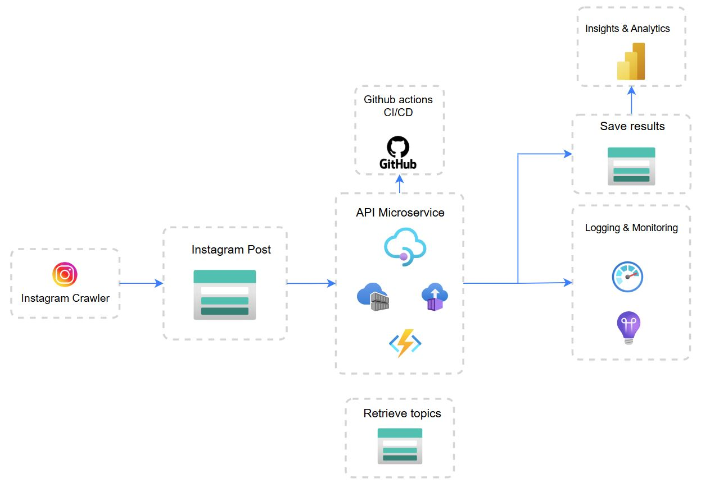

# instagram-topic-classification

A FastAPI-based microservice for analyzing Instagram post content. This service classifies a post into predefined topics and performs sentiment analysis.

---

## **Table of Contents**
1. [Features](#features)
2. [Architecture Overview](#architecture-overview)
3. [Setup Instructions](#setup-instructions)
4. [Usage](#usage)
5. [Deployment](#deployment)
6. [Potential Azure architecture](#potential-azure-architecture)

---

## **Features**
- **Topic modelling**: Cluster the topics from existing instagram posts using LDA (Latent Dirichlet allocation) algorithm ( instructions in eda-topic-modelling.ipynb) . Eventually 50 topics were chosen. 
- **Topic Classification**: Identify the most relevant topics from a predefined set.
- **Sentiment Analysis**: Determine the sentiment (positive/negative) of a post.
- **REST API**: Easily accessible endpoints for integration with other services.
- **Dockerized**: Deploy seamlessly using Docker.

---

## **Architecture Overview**
This microservice uses:
- **FastAPI** for API creation.
- **Web Server** : Uvicorn
- **Hugging Face Transformers** for sentiment analysis using a DistilBERT model and for topic classification using Facebook pretrained BART (Bidirectional and Auto-Regressive Transformers) model.
- **Docker** for containerization.
- **Frontend** HTML templates and CSS styling for a simple UI.
  
High-level architecture:
1. Input: Instagram post text.
2. Processing:
   - Predict the top topics and their probabilities.
   - Analyze the sentiment of the post.
3. Output: text response containing both predictions (top 5 categories and sentiment classification)

---

## **Setup Instructions**

### **Prerequisites**
- Python 3.10+
- Docker (optional for containerized deployment)

### **Local Installation**
1. Clone the repository:
   ```bash
   git clone https://github.com/YasMNEJJA/instagram-topic-classification.git
   cd 
   ```

2. Install Dependencies:
    ```bash
    pip install -r requirements.txt
    ```
### **Run the application**

1. Run locally:
    ```bash
    uvicorn api.app:app --reload
    ```

    Access the web interface at: http://127.0.0.1:8000

2. Run with Docker:

    Build the docker :
    
    ```bash
    docker build -t instagram-post-classifier .
    ```

    Run the container:

    ```bash
    docker run -d -p 8000:8000 instagram-post-classifier
    ```

    Access the app at http://localhost:8000

---

## **Usage**

- Enter a post example in the UI : 
    
    Exciting day at our startup! 🚀 Signed our first big client, and the team is thrilled. #entrepreneur #startup #business

    

- Example response: 

    

---

## **Deployment**

This microservice can be deployed using container orchestration platforms like Kubernetes or hosted on cloud platforms such as Azure App Services, Azure container instaces,  AWS ECS, or Google Cloud Run.


---

## **Potential Azure architecture**

### For topic modelling 


### For processing incoming posts



